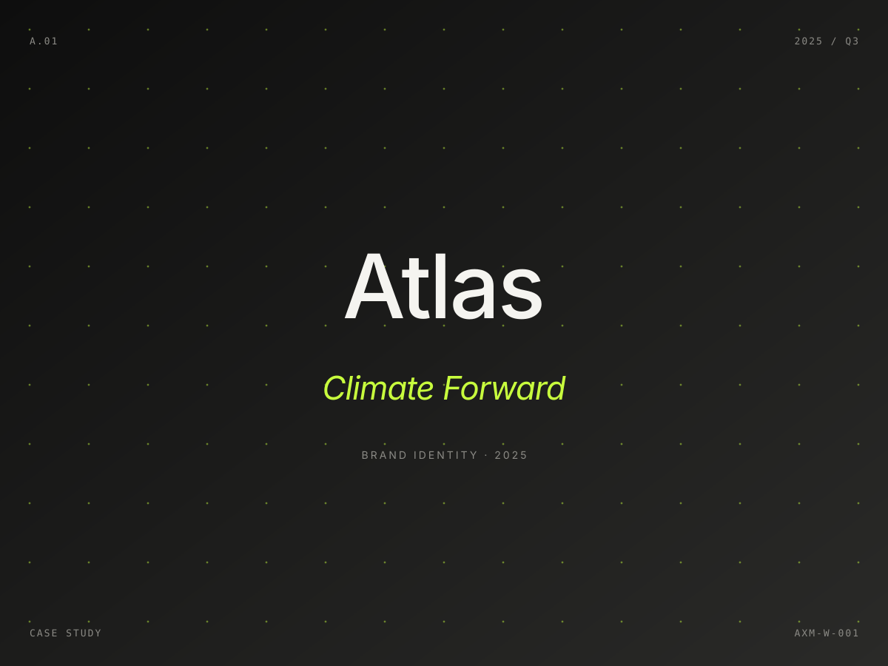

# Axioma — Creative Agency Website Template

Editorial Swiss-agency aesthetic. Five pages. Monochrome (off-white #F5F4F0 + off-black #0E0E0E) with a single electric-lime accent (#C8FF3D). Bricolage Grotesque + Geist via Google Fonts. Vanilla HTML/CSS/JS — no build step, no framework.

## Pages

| Page | File | Purpose |
|---|---|---|
| Index | `index.html` | Hero, featured work, services list, client marquee, manifesto, CTA |
| Work | `work.html` | Filterable case-study grid (10 projects) |
| Services | `services.html` | Six practice areas with deliverables and process |
| Studio | `about.html` | Story, four-person team grid, values, awards, careers |
| Contact | `contact.html` | Two studio addresses, channels, full enquiry form |

## Composition

This template uses **composition J**: a left-pinned logo and navigation rail with the right side scrolling editorial content panels. On mobile (≤768px) the rail collapses into a top bar with an overlay menu.

## Design tokens

All design tokens live in CSS custom properties at the top of `assets/css/styles.css`:

- **Palette** — `--paper`, `--ink`, `--lime`, `--lime-deep`, plus support tints.
- **Typography** — `--display` (Bricolage Grotesque), `--sans` (Geist), `--mono` (Geist Mono). Sizes are clamp-based and fluid.
- **Layout** — `--rail`, `--pad-x`, `--pad-section`, `--container-narrow`.
- **Motion** — `--ease`, `--ease-out`. All scroll reveals use `opacity` + `transform` only (compositor-friendly).

Reduced motion is respected (`prefers-reduced-motion: reduce`).

## Replacing images

Every `` is preceded by an HTML comment with the recommended dimensions:

```html
<!-- REPLACE: Atlas Climate brand campaign · 1200×900 · WebP/JPG -->

```

The included SVGs are intentional, labeled placeholders — drop in real photography or the SVGs will still ship looking deliberate. Recommended formats: WebP or AVIF for photography, SVG for marks.

| Slot | Recommended size |
|---|---|
| Work cards (home + work page) | 1200×900 (4:3) |
| Team portraits | 600×750 (4:5) |
| About / studio interior | 800×1000 (4:5) |

## Replacing copy

All copy is in the HTML files directly. Key strings to swap:

- Brand name: `Axioma` (find/replace in all 5 HTML files)
- Tagline / strapline: search for "Independent creative agency"
- Studio addresses: `contact.html` — two `<address>` blocks
- Email addresses: `hello@axioma.studio`, `press@`, `careers@`
- Phone: `+1 (212) 555-0144`
- Founder names: `Mira Halden`, `Tomás Reyes` (in `about.html` + `index.html` manifesto signature)
- Client names: `clients-marquee` block in `index.html`
- Awards: `awards-list` block in `about.html`

## Browser support

Modern evergreen browsers. Tested at 320, 768, 1024, 1440, 1920.

## Performance notes

- Two preconnects to Google Fonts only.
- Below-the-fold images use `loading="lazy"`.
- Animations are `opacity` and `transform` only — no layout-shifting properties.
- No external JS dependencies. Single ~2 KB `main.js` for reveal-on-scroll, mobile nav, and the work-page filter.

## License

Free for personal and commercial use. See html.design license terms.
